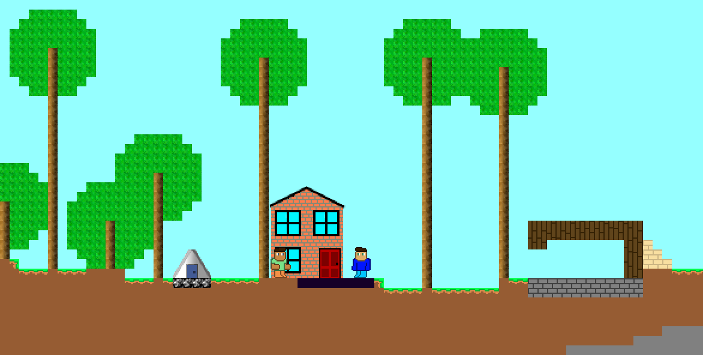

# My Pygame Game

This is the repository for my PyGame game.



It is inspired by block games like Minecraft and Terraria, however the art style is more simplistic.

# Downloading

You can download the game from the releases tab on the right. To run the game from it's source, you just need to install pygame and run main.py while in the root directory of the project.

# About

It is 2D and features NPCs, quests and time travel. Some of the features it has are:
- [Mining and breaking blocks](https://youtu.be/kDAm7d7oeAI)
- [Custom character creation](https://youtu.be/vcDK2qk5vPE)
- [A cutscene at the beginning of the game (featuring your character!) as well as Quests and Dialogue (very unfinished)](https://youtu.be/1w8Em5kjRDk)
- [Time travel! Long jumps forward may take a while as it simulates each year for a deterministic behaviour.](https://youtu.be/WNyQ4p1mzkg)
  - Over time, NPCs will be born and die, and as new time periods approach, they'll upgrade their houses.
- [Really tall trees (too tall?) which actually fall down](https://youtu.be/7ndYUzPLKdw)
- [Crafting](https://youtu.be/5lBjUgyfUiE)
- [An inventory system](https://youtu.be/lqNG7SAMdHU)
- [Some ok music](https://youtu.be/dLLbDeU_KA0)

# Why isn't it finished?

When I got to this stage in the development I realised that the game was trying to be 2 completely different games. Maybe I'll carry on working on it one day.

# File Structure
most of the code is within a few different modules.

The python files and their purpose are listed below.
Most files are somewhat commented. The repetitive parts sometimes aren't as I was getting bored.

```
project
│   main.py -- Import all modules and start the game.
|   constants.py -- Store variables that don't change and handle debug command-line flags
│   setup.py -- Builds the game into the zip. Not actually included in the zip.
│
└───engine -- Handles all things which are objects within the game e.g. blocks, houses, people and the inventory
│   │   blocks.py -- Initialises a bunch of constants to define all blocks and their properties.
│   │   buildings.py -- Loads building textures. Buildings in-world are treated as a rectangle of blocks.
|   |   character.py -- Handles rendering characters and their collisions. Includes the player and NPCs.
|   |   crafting.py -- Defines the crafting recipes that are available.
|   |   inventory.py -- Handles the hotbar, inventory and crafting buttons.
|   |   items.py -- Loads item textures and handles items in-world.
|   |   player.py -- Adds a keyboard input to a character.
|   |   tiles.py -- Loads all the block textures (and compiles the grass ones from multiple images).
|   |   world.py -- Handles where blocks are and rendering them. Also stores many pointers to various classes.
|   |     It also evolves the world over time when time traveling
└───karas -- Handles rendering some common GUI elements. Also houses the main in-game file.
|   │   colourpicker.py -- Handles the colour picker in the character select menu.
|   |   game.py -- The window itself
|   |   keypad.py -- Renders the keypad you see to enter a time to travel to.
|   |   sprite.py -- A general class for sprites. Used by players and in-world items.
|   |   textbox.py -- A text input used to enter a save name.
|   |   types.py -- Hosts a couple of exceptions raised to escape many layers of nesting it may be in.
|   |   utils.py -- Has code to draw antialiased stuff, and colour-related operations.
└─── mono
|   |   __init__.py -- Handles the music.
└───olivas -- Anything related to NPCs.
|   |    book.py -- Tracks quests and generates NPCs.
|   |    cutscenenpc.py -- An NPC in a cutscene. Gives the ability to control their movement in it.
|   |    npc.py -- Code for NPCs.
|   |    quests.py -- A class which each quest is an instance of.
|   |    speech.py -- Renders dialogue.
└───saras -- Cutscene things.
|   |    cutscene.py -- The code to run the cutscene.
|   |    easing.py -- Code to ease a value between 2 integers, 2D points or colours.
└───theas -- Each file represents a different "screen" the game can be in e.g. title screen, pause menu.
    |    character_creator.py -- The character creator
    |    esc.py -- The pause menu.
    |    game.py -- Hosts the in-game loop and some logic for it.
    |    loader.py -- Loading screen.
    |    save_chooser.py -- Allows the user to select a save to open.
    |    saver.py -- Saves and loads the game.
    |    settings.py -- Unused at the moment.
    |    text_prompt.py -- Used when asking for a save name
    |    title.py -- Title screen
```